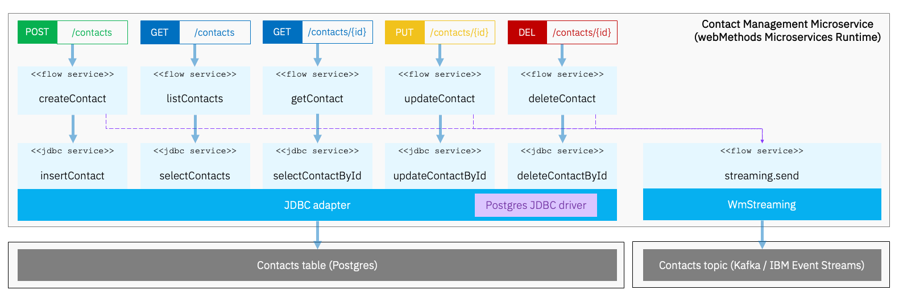
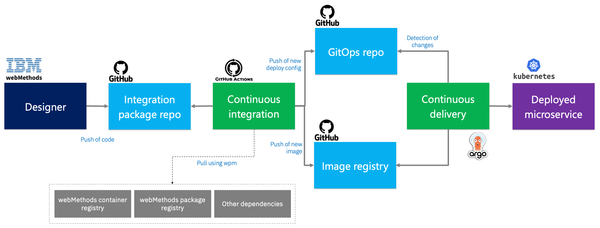
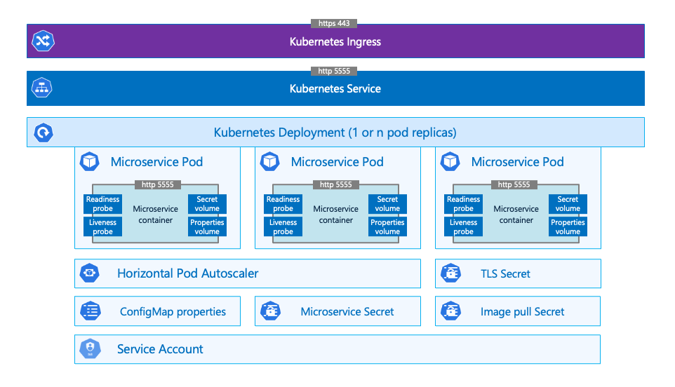

# Contact Management Integration microservice

This repository showcases the use of the webMethods Microservices Runtime (MSR) to implement an integration microservice. 

## Logical architecture

The microservice in question:
- exposes a classical CRUD REST API implemented in a contract first approach. [See the OpenAPI specification](./resources/api/ContactManagementAPI.yml)
- persists its contact data in a Postgres database, via the JDBC adapter (WmJDBCAdapter.) [See the database definition file](./resources/database/contacts.ddl.sql)
- produces Kafka events using webMethods Streaming (WmStreaming)
  

## Development environment

The microservice has been developed using the webMethods Service Designer, which can be downloaded [at this location](https://www.ibm.com/resources/mrs/assets/DownloadList?source=WMS_Designers).  
The bundle contains the Designer, an instance of the Microservices Runtime (MSR) and a few usefull webMethods packages: JDBC adapter, Streaming, Flat file, Unit test manager.  
The microservice is implemented using in a sttContactManagement package that is pushed to this Github repository. It uses a small framework that is placed in a sttFramework package, located in [another Github repository](https://github.com/staillanibm/sttFramework).  

## CI/CD

This repo contains a [Github actions "Build and push the image " workflow](./.github/workflows/build-push.yml), which takes care of the continuous integration aspects. The microservice image is built using a [classical Dockerfile](./Dockerfile). It also updates the [GitOps repository](https://github.com/staillanibm/sttGitOps/blob/main/msr-contact-management/k8s/int/kustomization.yaml) with the tag of the newly created image.  
Then ArgoCD detects the new image tag in the GitOps repo and triggers a deployment of the corresponding image (rolling update strategy.)  
At the end of the deployment, an Argo workflow is executed to run end to end API tests using Newman. These tests are specified in a [Postman collection](./resources/tests/ContactManagementAutomated.postman_collection.json).  

Notes:
- the "Build and push the image " workflow could be enhanced with tests, for instance using Wm Unit Test
- GitOps is of course not the only approach to deal with continuous delivery. A Github actions workflow could also do the job

## Deployment architecture

The microservice is deployed in Kubernetes, in the form of a plain stateless deployment. We use an application.properties file to manage the microservice configuration (connection), associated to a secret that contains the confidential configuration elements. The ingress deals with TLS termination, exposing a http 443 endpoint that is routed to the usual http 5555 port exposed by webMethods IS / MSR.

Notes:
- from a security standpoint, this deployment could be hardened:
    -   addition of a dedicated service port to serve API traffic, possibly with TLS passthrough
    -   safeguarding of the MSR admin port
- Postgres and Kafka aren't represented here. They could be SaaS resources or deployments inside the same Kubertes cluster.  